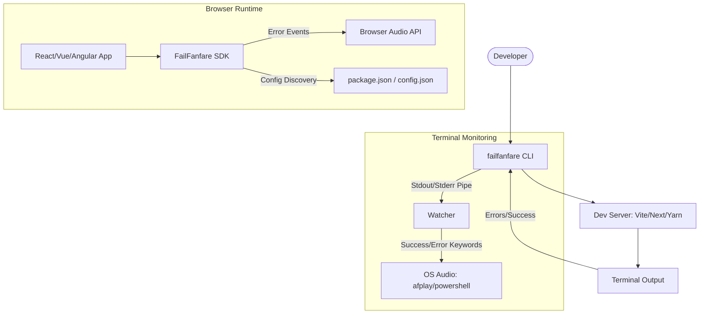
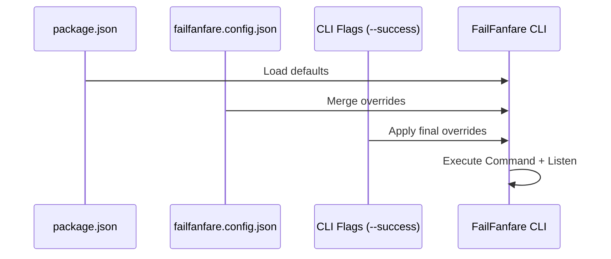

# FailFanfare

  

> The ultimate debugging companion that turns "Oh No!" into "Oh My God Wow!"

FailFanfare is a fun, personality-driven feedback system that plays sound effects while you work. It bridges the gap between your browser and your terminal, making sure you actually enjoy the chaos of development.

---

## Architecture Overview

FailFanfare operates as a **Hybrid SDK**, monitoring both your frontend application and your development server.

---

## Key Features

### Hybrid CLI Wrapper

Wraps any command (e.g., `npx failfanfare npm run dev`) to provide instant audio feedback when your server starts, crashes, or encounters compilation errors.

### Cross-Framework SDK

First-class support for **React**, **Vue 3**, **Angular**, and **Vanilla JS**. It hooks into global error handlers and `console.error` to notify you of issues even when the browser tab is hidden.

### Smart Escalation

If errors start spamming (5+ in a short window), the sound escalates to a "Critical Error" state—perfect for catching infinite loops or major system failures early.

### Unified Configuration

Configure once in your `package.json`. Both the CLI and your frontend code will automatically synchronize to use the same custom mapping.

### Performance Optimized

- **Browser**: Ultralight (4KB) bundle. Sounds are hosted on a global CDN to prevent slowing down your HMR.
- **Node**: Direct native OS integration—no bulky dependencies.

---

## Project Structure

- [**failfanfare_sdk/**](./failfanfare_sdk/) — The core logic, adapters, and CLI binary (v0.3.1).
- [**webapp/**](./webapp/) — The premium technical documentation portal (v0.1.0).
- [**examples/**](./examples/) — Quick-start templates for React and other frameworks.

---

## Configuration Flow

---

## License

This project is licensed under the MIT License - see the [LICENSE](./LICENSE) file for details.

---

MIT © Lancerhawk
